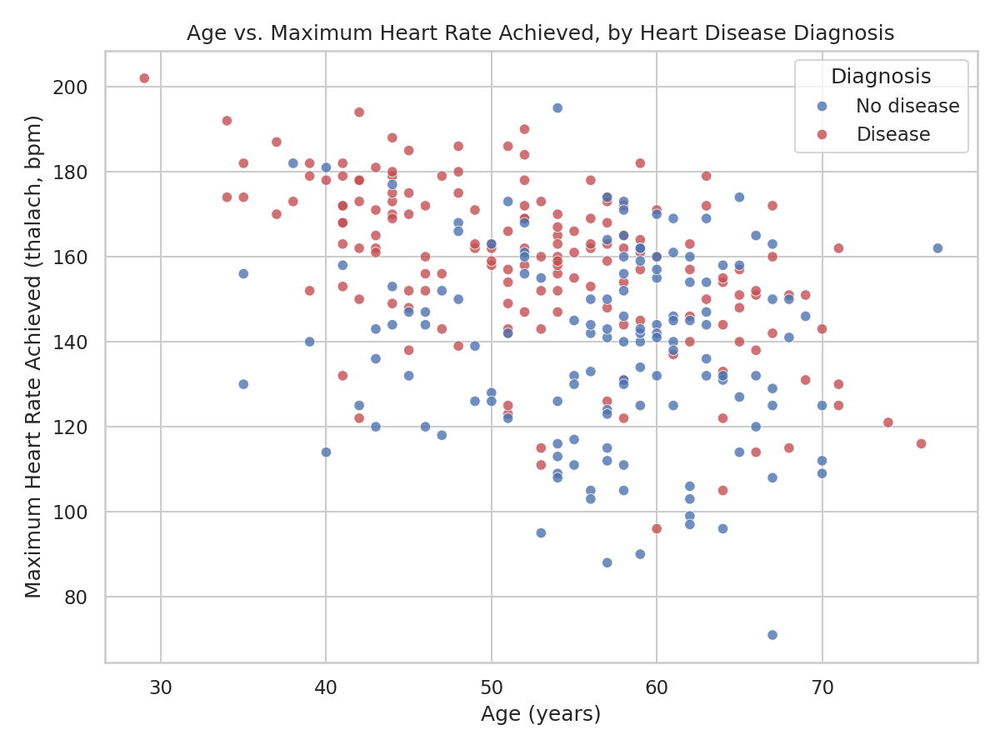

# Heart Disease UCI - Exploratory Data Analysis

[](https://github.com/Zzqc-chien/IDS706-Assignment-2/actions/workflows/tests.yml)

Series 1 of a 3-week data analysis project. This week covers importing and
inspecting a dataset, basic filtering/grouping, an initial ML exploration,
and one visualization.

## Project Goal

Explore the classic **Heart Disease UCI** dataset to understand which
patient attributes (age, sex, chest pain type, cholesterol, max heart rate,
etc.) are associated with a heart disease diagnosis, and take a first pass
at predicting diagnosis from those attributes with a simple ML model.

## Data Source

- **Dataset**: Heart Disease UCI (Cleveland database subset), 303 patient
  records, 14 attributes.
- **Original source**: [UCI Machine Learning Repository](https://archive.ics.uci.edu/dataset/45/heart+disease),
  also widely mirrored on Kaggle (e.g. `navjotkaushal/heart-disease-uci-dataset`).
- **File used**: `heart.csv`, pulled from a public GitHub mirror of the
  cleaned CSV: https://github.com/sharmaroshan/Heart-UCI-Dataset

| Column | Meaning |
|---|---|
| age | age in years |
| sex | 1 = male, 0 = female |
| cp | chest pain type (0-3) |
| trestbps | resting blood pressure (mm Hg) |
| chol | serum cholesterol (mg/dl) |
| fbs | fasting blood sugar > 120 mg/dl (1 = true) |
| restecg | resting ECG results (0-2) |
| thalach | max heart rate achieved |
| exang | exercise-induced angina (1 = yes) |
| oldpeak | ST depression induced by exercise |
| slope | slope of the peak exercise ST segment |
| ca | number of major vessels colored by fluoroscopy (0-4) |
| thal | thalassemia indicator (0-3) |
| target | 1 = heart disease present, 0 = absent |

## Setup

```bash
python3 -m venv venv
source venv/bin/activate        # Windows: venv\Scripts\activate
pip install -r requirements.txt
python analysis.py
```

The script reads `heart.csv` from the project root, so run it from inside
this folder.

## Analysis Steps

1. **Import** - load `heart.csv` with Pandas.
2. **Inspect** - `.head()`, `.info()`, `.describe()`, and checks for missing
   values and duplicate rows.
3. **Filter & group** - filter patients over 50 who were diagnosed with
   heart disease; group by `sex` and by chest pain type (`cp`) to compare
   average age, cholesterol, max heart rate, and disease rate.
4. **ML exploration** - a `LogisticRegression` classifier (scikit-learn)
   trained on all 13 features to predict `target`, with an 80/20
   train/test split and standardized inputs.
5. **Visualization** - a scatter plot of age vs. max heart rate achieved,
   colored by diagnosis.
6. **Bonus: Pandas vs Polars** - the same read + de-duplicate + group-by
   pipeline timed in both libraries.

## Outcomes / Findings

- The dataset is clean: **no missing values**, and only **1 duplicate row**
  (dropped before analysis, leaving 302 rows).
- **32.8%** of patients are over 50 and diagnosed with heart disease.
- Grouped by sex: women in this sample have a notably higher disease rate
  (**75%**) than men (**45%**), despite similar average age.
- Grouped by chest pain type: patients with **atypical angina** or
  **non-anginal pain** have much higher disease rates (~80%) than those
  with **typical angina** (27%) - counter-intuitive at first glance, but
  consistent with this being a well-known quirk of the dataset (classic
  "typical angina" is actually the least common presentation among
  diagnosed cases here).
- The logistic regression model reached **~79% accuracy** on the held-out
  test set. The most influential features (by standardized coefficient
  magnitude) were chest pain type (`cp`), `sex`, ST depression (`oldpeak`),
  max heart rate (`thalach`), and `thal`.
- The Pandas vs. Polars timing comparison is inconclusive at this size, and
  that's the interesting finding: with only 302 rows, both libraries finish
  the read + de-duplicate + group-by pipeline in a few hundredths of a
  second, dominated by per-call overhead (e.g. Polars spinning up its thread
  pool) rather than actual computation. Which one comes out ahead varies by
  run and machine - on one run Pandas was faster. Polars' multithreaded,
  Rust-based engine is expected to pull ahead once the dataset is large
  enough that computation time dominates overhead, not on a dataset this
  small.

See `age_vs_heartrate_by_diagnosis.png` for the visualization.



## Files

- `analysis.py` - full analysis script (run this)
- `heart.csv` - dataset
- `age_vs_heartrate_by_diagnosis.png` - output visualization
- `requirements.txt` - Python dependencies

## Refactoring Motto

> "Refactor Early, Refactor Often: Keep Your Codebase's Cholesterol Low!"

## Testing

This project uses **pytest** to test the core components of the data analysis workflow.

The test suite includes:

- Data loading and schema validation
- Missing-file edge case
- Data preprocessing and duplicate removal
- Feature and target preparation
- Logistic regression model training and prediction
- End-to-end system testing from data loading through visualization

Run all tests with:

`python -m pytest -v`

Run tests with coverage:

`python -m pytest -v --cov=analysis --cov-report=term-missing`

The current test suite contains **6 tests**, and all tests pass successfully with **75% code coverage**.

## Continuous Integration

GitHub Actions automatically runs the complete test suite whenever changes are pushed to the `main` branch or when a pull request targets `main`.

The workflow is defined in `.github/workflows/tests.yml` and automatically sets up Python, installs dependencies, and runs pytest with coverage.

The CI status badge at the top of this README shows the latest workflow result.

## Phase 2 Improvements

In this phase, the original Assignment 2 analysis was refactored into reusable functions for data loading, preprocessing, feature preparation, model training, prediction, evaluation, and visualization.

Unit tests and an end-to-end system test were added to improve reliability and reproducibility. GitHub Actions now automatically verifies that the project continues to work whenever changes are pushed.
