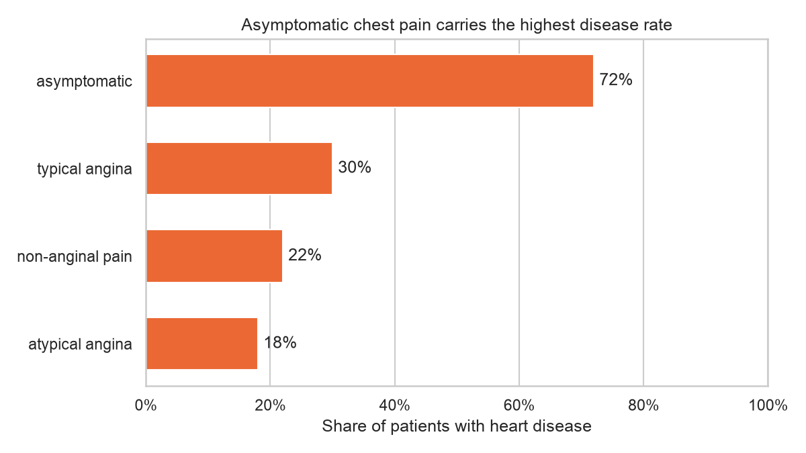
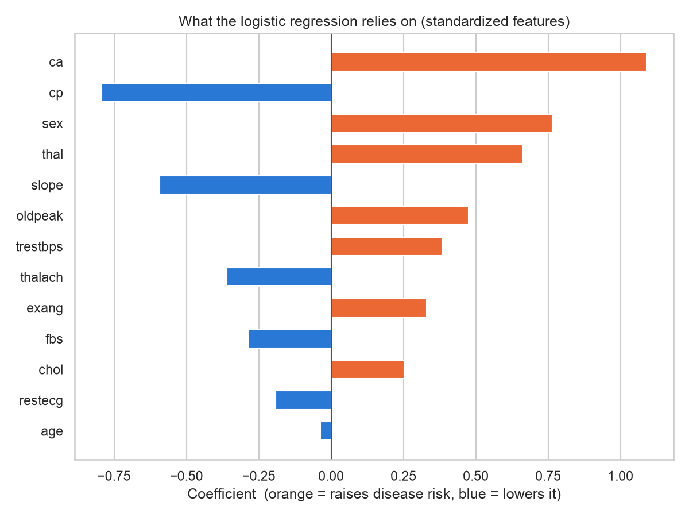
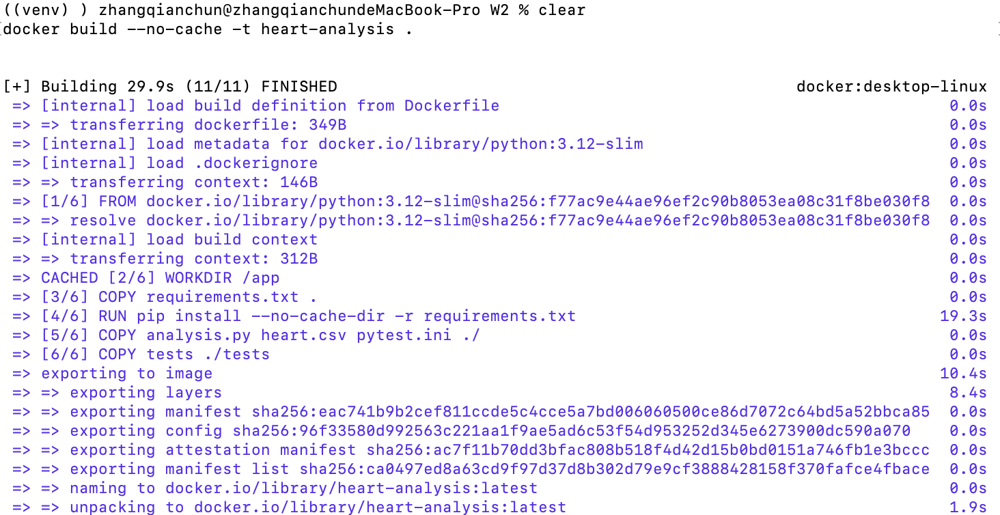
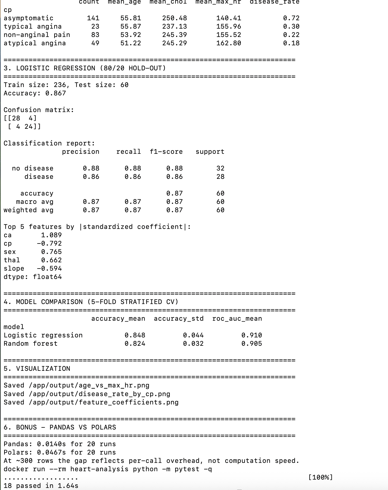
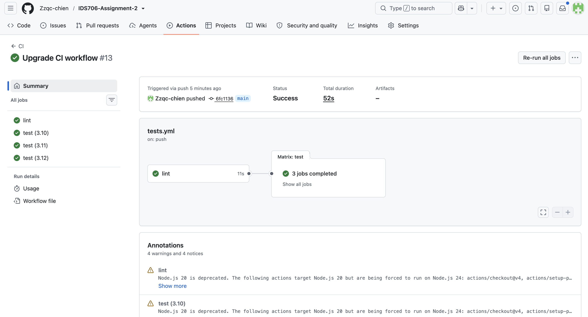
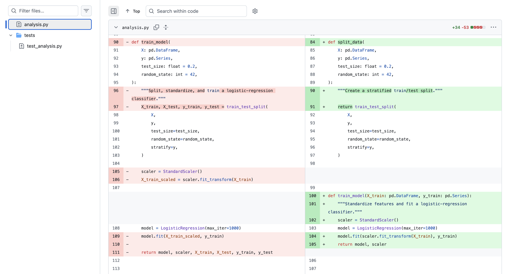

# Heart Disease UCI: Which Clinical Signs Point to Heart Disease?

[](https://github.com/Zzqc-chien/IDS706-Assignment-2/actions/workflows/tests.yml)

> **Refactoring motto:** *"Refactor Early, Refactor Often: Keep Your Codebase's Cholesterol Low!"*

## Problem

Using routine clinical measurements from 303 patients (Cleveland Clinic subset of the
UCI Heart Disease data), this project asks:

1. Which patient attributes are most associated with a heart-disease diagnosis?
2. How well can a simple, interpretable model predict the diagnosis?

## Data and cleaning

**Source:** `heart.csv` from a public mirror
([sharmaroshan/Heart-UCI-Dataset](https://github.com/sharmaroshan/Heart-UCI-Dataset))
of the [UCI Heart Disease dataset](https://archive.ics.uci.edu/dataset/45/heart+disease).

**The mirror is not identical to the original.** Comparing it with UCI's
`processed.cleveland.data` ([`scripts/verify_labels_against_uci.py`](scripts/verify_labels_against_uci.py)) showed:

| Issue in `heart.csv` | Verification | Treatment |
|---|---|---|
| `target = 1` means no disease | All 302 deduplicated records matched uniquely to UCI; zero target mapping mismatches | Create `disease = 1 - target` |
| Chest-pain categories are recoded | Zero mismatches after mapping UCI codes to mirror codes | Label `0` = asymptomatic, `1` = atypical angina, `2` = non-anginal pain, `3` = typical angina |
| Missing values use sentinel codes | Two `thal = 0` records and four `ca = 4` records correspond to missing UCI values | Replace these codes with missing values and drop the six affected rows |

The verification matches records using eight unchanged attributes. `restecg` is
excluded from matching because its category codes also differ between sources.

| Cleaning step | Rows |
|---|---|
| Loaded | 303 |
| Exact duplicate removed | −1 |
| Rows with disguised missing values dropped (`thal = 0` ×2, `ca = 4` ×4) | −6 |
| **Final** | **296** |

**Outliers:** the 1.5 × IQR rule flags observations in resting blood pressure,
cholesterol, maximum heart rate, and ST depression. Flagged rows are retained:
an IQR flag alone does not establish a data-entry error. Standardization does
not remove their influence; comparing results with and without flagged rows
is a future robustness check.

## Methods

- **Exploration:** filtering (patients over 50 with disease) and grouping by sex and chest-pain type.
- **Model:** logistic regression on 13 features, an 80/20 stratified hold-out, and a fixed split seed of 42. The scaler is fitted on the training data only.
- **Model comparison (my addition):** 5-fold stratified cross-validation of logistic
  regression vs. random forest, because a single split of ~300 rows is noisy.
  Logistic regression uses a scaling pipeline fitted within each training fold.
- **Bonus:** the same read → de-duplicate → group-by pipeline timed in Pandas and Polars.

## Key findings

| | Result |
|---|---|
| Disease rate by sex | men **56%**, women **25%** |
| Disease rate by chest pain | asymptomatic **72%**; typical angina 30%, non-anginal 22%, atypical 18% |
| Logistic regression (hold-out) | accuracy **0.867** on 60 test records |
| Logistic regression (5-fold CV) | accuracy **0.848 ± 0.044**, ROC AUC 0.91 |
| Random forest (5-fold CV) | accuracy 0.824 ± 0.032, ROC AUC 0.905 |

Cross-validation accuracy is reported as mean ± standard deviation across five
folds. These results correspond to the saved container-run evidence; dependency
versions can cause small differences between runs.

<p>
  
  
</p>

More: [age vs. max heart rate](figures/age_vs_max_hr.png).

**Takeaways**

- **Verify labels before interpreting results.** Checking the source corrected
  the target interpretation and chest-pain labels, changing earlier conclusions.
- In this sample, the asymptomatic chest-pain category had the highest observed
  disease rate (72%). This is a sample association, not a population-level
  screening recommendation.
- Logistic regression achieved slightly higher mean cross-validation accuracy
  than random forest in this run. This does not establish consistent superiority.

**Limitations:** single-center sample of 296 patients; `cp` and `thal` are
categorical but entered the model as integers (one-hot encoding is the next step);
this is an exploratory analysis, not a diagnostic tool.

## How to run

Run from the repository root using Python 3.12:

```bash
python3 -m venv .venv
source .venv/bin/activate
make install      # installs runtime dependencies plus Black and Flake8
make lint
make test         # 18 tests with coverage
make run          # prints results and writes figures/
```

On Windows, activate with `.venv\Scripts\activate` instead.
`make` commands require Make; Python analysis can also be run directly with
`python analysis.py` after installing `requirements-dev.txt`.

`requirements-lock.txt` records package versions from the tested local Python
3.12 environment. It is an optional installation snapshot, not a cross-platform
lock guarantee. CI and Docker install from `requirements.txt`.

```bash
# Optional: install the recorded local package versions
python -m pip install -r requirements-lock.txt

# Verify label mappings against UCI (internet required)
python scripts/verify_labels_against_uci.py
```

## Docker

Start Docker Desktop (or a Docker daemon) before running:

```bash
make docker-build   # docker build -t heart-analysis .
make docker-run     # docker run --rm -v "$(pwd)/output:/app/output" heart-analysis
make docker-test    # docker run --rm heart-analysis python -m pytest -q
```




Additional evidence: [container status](docs/images/docker_ps.png).
The analysis is a batch job: the container exits after it finishes. Generated
figures remain in the host's `output/` directory when using `make docker-run`.

**What I learned**

- Copying `requirements.txt` before application code lets Docker reuse the
  dependency layer when only the code changes.
- `.dockerignore` keeps `venv/` and other local files out of the build context.
- Containers are disposable, so outputs need a volume (`-v …:/app/output`); the output
  location is configurable with the `OUTPUT_DIR` environment variable.
- This container runs without a graphical display, so matplotlib uses
  `MPLBACKEND=Agg` to save plots to files.

## Continuous integration

[`.github/workflows/tests.yml`](.github/workflows/tests.yml) runs on every push/PR to
`main`, **weekly (Mondays 13:00 UTC)**, and on demand:

1. **lint** — `black --check` and `flake8`
2. **test** — matrix over **Python 3.10 / 3.11 / 3.12**, pytest with coverage
3. **docker** — builds the image, then runs the tests and the analysis inside it



## Testing

18 pytest tests (~80% coverage) in [`tests/test_analysis.py`](tests/test_analysis.py):

- **Typical cases:** loading, cleaning, feature preparation, training, cross-validation, end-to-end pipeline.
- **Edge cases:** missing file, empty CSV, missing column, one-class target, NaN in features, zero-spread column in the IQR check.
- **Dataset regression checks:** group-rate patterns guard against accidental
  changes to this dataset's interpretation. They are not general clinical rules
  or a substitute for source verification.
- **Consistency:** Polars and Pandas return the same group-by result.

## Refactoring

**What changed** (commit [`cb962d9`](https://github.com/Zzqc-chien/IDS706-Assignment-2/commit/cb962d9)):

| Smell | Change |
|---|---|
| Returning too much data: `train_model` returned 6 values | extracted `split_data()`; `train_model` returns `(model, scaler)` |
| Duplicated work: `main()` loaded the data, then `run_pipeline()` loaded it again | `main()` calls `run_pipeline()` once |
| `classification_report` computed twice | computed once in `evaluate_model()` |
| Magic strings (`"target"`, class names) repeated | constants `TARGET_COL`, `TARGET_NAMES` |
| Dead code and vague names | removed unused label maps; `create_visualization` → `plot_age_vs_max_hr` |

**Why:** each function now does one job, which made the later cleaning and
cross-validation features easy to add without touching the model code.

**Verification:** the refactoring commit updated the affected model test to use
`split_data()`. The current project passes Black, Flake8, all 18 pytest tests,
and the Docker build/test/run workflow in GitHub Actions.

An AI assistant helped draft the change; I reviewed each edit, ran the checks above, and kept only changes that preserved behavior.



## Project structure

```
analysis.py                     # cleaning, analysis, models, figures
tests/test_analysis.py          # pytest suite
scripts/verify_labels_against_uci.py
figures/                        # generated figures used in this README
docs/images/                    # screenshots
requirements.txt                # runtime and test dependencies
requirements-dev.txt            # runtime dependencies plus lint tools
requirements-lock.txt           # local Python 3.12 package snapshot
Dockerfile, .dockerignore, Makefile, .flake8
.github/workflows/tests.yml     # CI
rust_vs_python_intro.ipynb      # separate Week 2 Rust ownership exercise
```
